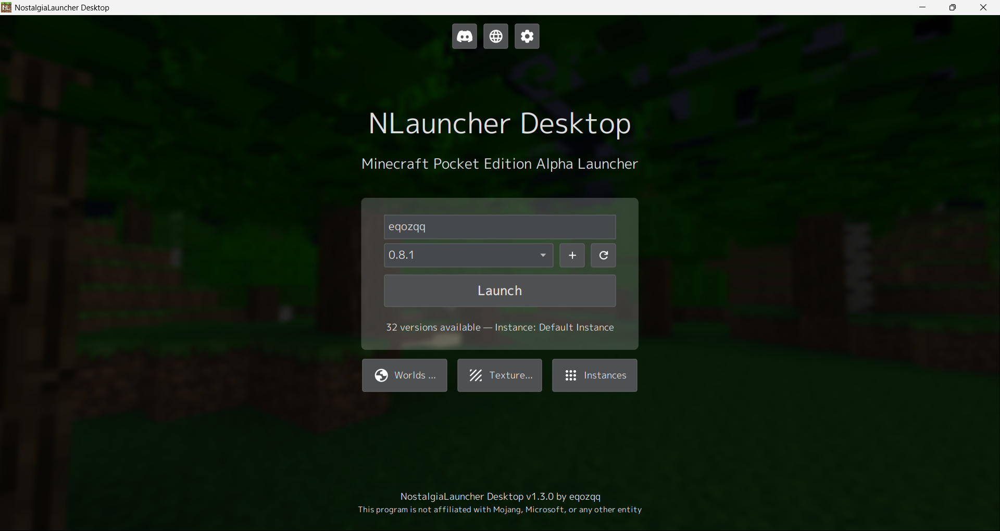

# NostalgiaLauncher Desktop
Minecraft PE Alpha versions launcher for Windows and Linux

## Functions
- Download and quickly switch between versions
- Add your own version sources and custom executables for launching versions
- World manager that allows editing world info
- Fast texture installer
- Instances
- And more..

## Used materials
NostalgiaLauncher Desktop uses [Ninecraft](https://github.com/MCPI-Revival/Ninecraft) to run Minecraft PE versions (the default executable for launching versions).

Also used [SpoutNBT](https://github.com/zhuowei/SpoutNBT) for world management.

## Screenshot
